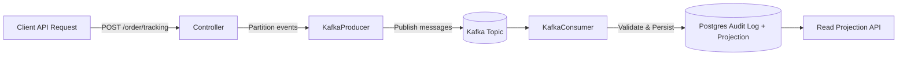

# Order Tracking Service

A production-style **Spring Boot 3** and Kafka service that ingests order-tracking events, validates state transitions, persists the full audit trail, and exposes a projection for quick reads. Built as a portfolio project to showcase clean architecture, observability, testability, and hands-on DevOps.

---

## ✨ Features

- **REST API** to submit tracking events at `/order/tracking` (accepts **JSON** and **XML**).
- **Kafka-backed ingestion pipeline**:
  - API requests are **partitioned into individual events**.
  - Each event is published to a **private Kafka topic**.
  - A dedicated consumer persists events and updates projections.
- **State machine** with auditable transitions:
  - `PICKED_UP_AT_WAREHOUSE` → initial
  - `OUT_FOR_DELIVERY`
  - `DELIVERY_ISSUE`
  - `DELIVERED` → final
- **Append-only audit log** for all events per order, plus a **read-optimized projection** (e.g., `orders`).
- **Validation** of illegal or out-of-order transitions.
- **OpenAPI / Swagger UI** for interactive docs.
- **Observability**: Spring Boot Actuator (health, metrics) and Prometheus scrape endpoint.
- **Solid tests** with JUnit 5, REST Assured, Testcontainers.
- **Docker-ready**: Postgres, Kafka, Adminer via Docker Compose, runnable locally with Make targets.

---

## 🧩 Architecture

The service follows a **clean / hexagonal** style, now extended with **event-driven ingestion**:

- **Domain**: order event model and business rules for state transitions.
- **Application**: use cases to apply and validate events, and produce the read projection.
- **Adapters**:
  - Inbound: HTTP controller, Kafka consumer.
  - Outbound: Kafka producer, persistence adapters (JPA/Hibernate).
- **Infrastructure**: Spring Boot configuration, Postgres, Kafka, observability and OpenAPI.

### Event Flow (Mermaid diagram)



This design allows:
- Simple, immutable, and serializable event ingestion.
- Horizontal scaling of producers and consumers.
- Decoupled ingestion vs. persistence (resilient to DB or consumer slowdowns).

---

## 🚀 Quick Start

### Prerequisites
- **JDK 17+**
- **Maven 3.9+**
- **Docker** (for Postgres, Kafka, Adminer and Testcontainers)
- **Make** (optional, quality-of-life shortcuts)

> Copy environment defaults and customize if needed:
>
> ```bash
> cp .env.example .env
> ```

### Option A — Run with in-memory H2

```bash
make run
```

- Swagger UI: <http://localhost:8080/swagger-ui>
- Health: <http://localhost:8080/actuator/health>

### Option B — Run with Postgres + Kafka (Docker Compose)

```bash
make up         # starts Postgres + Kafka + Adminer
make run-pg     # runs the Spring Boot app with Postgres profile
```

- Adminer: <http://localhost:8081>
- Swagger UI: <http://localhost:8080/swagger-ui>
- Kafka UI (if enabled): <http://localhost:8082> (optional)

> **Without Make:**
> ```bash
> docker compose -f deploy/docker-compose.yml up -d
> mvn spring-boot:run -Dspring-boot.run.profiles=pg
> ```

---

## 🧪 Testing

This project uses **JUnit 5**, **REST Assured**, **Testcontainers** (Postgres + Kafka):

```bash
mvn -q clean verify
```

- Unit tests: state machine and validation rules.
- Integration tests: containers for realistic end-to-end checks (DB + Kafka).

---

## 📡 API

### Endpoint
`POST /order/tracking`

Sends one or more events. The service validates transitions and returns, for each event, whether it was accepted and sent to Kafka.

#### JSON example

```json
{
  "event": [
    {"orderId": "123", "status": "PICKED_UP_AT_WAREHOUSE", "eventTs": "2025-01-01T10:00:00Z"},
    {"orderId": "123", "status": "OUT_FOR_DELIVERY",      "eventTs": "2025-01-01T14:00:00Z"}
  ]
}
```

#### Response

```json
[
  {"orderId": "123", "accepted": true, "published": true},
  {"orderId": "123", "accepted": true, "published": true}
]
```

---

## 🔭 Observability

- **Actuator**: `/actuator/health`, `/actuator/metrics`, `/actuator/info`
- **Prometheus**: `/actuator/prometheus`
- **Structured logs**: application logs include Kafka offsets, request/response and domain events.

---

## 🧰 Project Structure

```
.
├── app/                # Spring Boot application (controllers, domain, persistence, config, Kafka)
├── deploy/             # Dockerfile and docker-compose (Postgres, Kafka, Adminer)
├── docs/               # Docs, diagrams, ADRs
├── scripts/            # Helper scripts (linting, db, etc.)
├── tools/grader/       # Local grading utilities
├── .github/            # GitHub Actions workflows
├── Makefile            # DX shortcuts (run, run-pg, up, test, etc.)
└── README.md
```

---

## 🛡️ Quality & CI

- **Static analysis & formatting** (via Maven plugins).
- **Conventional commits** and **semantic-release** configuration.
- **GitHub Actions**: build, test (with Kafka + Postgres), and publish artifacts.

---

## Infrastructure (AWS Preproduction)

This project includes a Terraform setup to deploy a **preproduction environment** on AWS.  
The goal is to have a production-like stack running in ECS, backed by MSK (Kafka) and RDS (Postgres), with CI/CD through GitHub Actions.

⚠️ Note: this is **not a real production setup**.  
For simplicity and cost reasons, some concessions are in place:
- MSK and RDS are provisioned in **public subnets** instead of private ones.
- No multi-AZ or high-availability guarantees.
- Minimal instance sizes and capacity.

See the dedicated [infra/README.md](infra/README.md) for full details on bootstrap, environments, and CI/CD integration.

---

## 🗺️ Roadmap / Ideas

- **Scalability**: multiple Kafka consumers (parallelism, partition-based).
- **API Gateway + policies**: rate limits, auth offloading.
- **Security foundations**: JWT/OAuth2, input fuzzing.
- **Observability**: Grafana dashboards for Kafka + DB.
- **Architecture (CQRS)**: split commands vs. queries.
- **Cache**: Redis for read-side caching.
- **Load testing**: JMeter or Gatling.
- **ML enrichment**: delivery delay prediction.
- **Tracing**: OpenTelemetry spans per Kafka event.
- **Idempotency**: deduplication on event ingestion.
- **Kubernetes**: Helm chart for demo deployment.

---

## 📄 License

Released under the **MIT License**. See `LICENSE` for details.

---

## 🙌 Credits

Made with ❤️ as a personal portfolio project to demonstrate practical, production-minded engineering.
