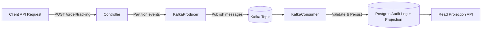

# Order Tracking Service

Order Tracking Service is a **Spring Boot 3** backend that accepts batches of tracking updates over HTTP, publishes one Kafka record per event keyed by `orderId`, and consumes those records to apply domain transition rules, append accepted events to an audit history, and update a read-oriented projection. Kafka separates request acceptance from downstream persistence; the ordering guarantee is per order within its Kafka partition, not global.

### Current limitations

- Producer idempotence, acknowledgements, and retries reduce duplicate publication risk, but the service does **not** provide end-to-end exactly-once processing. There is no durable event identity or database-level deduplication yet.
- Redelivery can therefore re-attempt database work after a partial failure, and there is no dedicated safe replay/backfill path yet.
- The repository documents local startup with Kafka and Postgres, but the complete clean-checkout path still needs explicit verification from a fresh clone.
- Actuator and Prometheus endpoints exist, but there is no published performance baseline, SLO, consumer-lag dashboard, or operational runbook.

---

## ✨ Features

- **REST API** to submit tracking events at `/order/tracking` (accepts **JSON** and **XML**).
- **Kafka-backed ingestion pipeline**:
  - API requests are **partitioned into individual events**.
  - Each event is published to a **private Kafka topic** using `orderId` as the Kafka key.
  - A dedicated consumer validates domain transitions, persists accepted events, and updates projections.
- **State machine** with auditable transitions:
  - `PICKED_UP_AT_WAREHOUSE` → initial
  - `OUT_FOR_DELIVERY`
  - `DELIVERY_ISSUE`
  - `DELIVERED` → final
- **Append-only audit log** for accepted events per order, plus a **read-optimized projection** (e.g., `orders`).
- **Validation** of required input fields and illegal state transitions at their respective processing boundaries.
- **OpenAPI / Swagger UI** for interactive docs.
- **Observability endpoints**: Spring Boot Actuator (health, metrics) and Prometheus scrape endpoint.
- **Tests** with JUnit 5, REST Assured, Testcontainers.
- **Docker-based local dependencies**: Postgres, Kafka, Adminer via Docker Compose, runnable locally with Make targets.

---

## 🧩 Architecture

The service follows a **clean / hexagonal** style, extended with **event-driven ingestion**:

- **Domain**: order event model and business rules for state transitions.
- **Application**: use cases to publish, apply and validate events, and produce the read projection.
- **Adapters**:
  - Inbound: HTTP controller, Kafka consumer.
  - Outbound: Kafka producer, persistence adapters (JPA/Hibernate).
- **Infrastructure**: Spring Boot configuration, Postgres, Kafka, observability and OpenAPI.

### Event Flow (Mermaid diagram)


```mermaid
flowchart LR
  Client[Client API Request] -->|POST /order/tracking| Controller
  Controller -->|Partition events| KafkaProducer
  KafkaProducer -->|Publish messages| Kafka[(Kafka Topic)]
  Kafka --> KafkaConsumer
  KafkaConsumer -->|Validate & Persist| DB[(Postgres Audit Log + Projection)]
  DB --> ReadAPI[Read Projection API]
```

This design provides:
- Simple, immutable, and serializable event ingestion.
- Independent producer/consumer scaling across Kafka partitions while events for one order remain ordered within their partition.
- Separation between request acceptance and persistence duration; consumer lag can still accumulate when downstream processing or the database is slow.

---

## 🚀 Quick Start

### Prerequisites
- **JDK 17+**
- **Maven 3.9+**
- **Docker** (for Postgres, Kafka, Adminer and Testcontainers)
- **Make** (optional, quality-of-life shortcuts)

> Copy environment defaults and customize if needed:
>
> ```bash
> cp .env.example .env
> ```

### Option A — Run with in-memory H2

```bash
make run
```

- Swagger UI: <http://localhost:8080/swagger-ui>
- Health: <http://localhost:8080/actuator/health>

### Option B — Run with Postgres + Kafka (Docker Compose)

```bash
make up         # starts Postgres + Kafka + Adminer
make run-pg     # runs the Spring Boot app with Postgres profile
```

- Adminer: <http://localhost:8081>
- Swagger UI: <http://localhost:8080/swagger-ui>
- Kafka UI (if enabled): <http://localhost:8082> (optional)

> **Without Make:**
> ```bash
> docker compose -f deploy/docker-compose.yml up -d
> mvn spring-boot:run -Dspring-boot.run.profiles=pg
> ```

---

## 🧪 Testing

This project uses **JUnit 5**, **REST Assured**, **Testcontainers** (Postgres + Kafka):

```bash
mvn -q clean verify
```

- Unit tests: state machine and validation rules.
- Integration tests: containers for realistic end-to-end checks (DB + Kafka).

---

## 📡 API

### Endpoint
`POST /order/tracking`

Sends one or more events. The service validates required input before publication and returns, for each event, whether it was accepted and sent to Kafka. Domain state transitions are validated when the consumer applies the event.

#### JSON example

```json
{
  "event": [
    {"orderId": "123", "status": "PICKED_UP_AT_WAREHOUSE", "eventTs": "2025-01-01T10:00:00Z"},
    {"orderId": "123", "status": "OUT_FOR_DELIVERY",      "eventTs": "2025-01-01T14:00:00Z"}
  ]
}
```

#### Response

```json
[
  {"orderId": "123", "accepted": true, "published": true},
  {"orderId": "123", "accepted": true, "published": true}
]
```

---

## 🔭 Observability

- **Actuator**: `/actuator/health`, `/actuator/metrics`, `/actuator/info`
- **Prometheus**: `/actuator/prometheus`
- **Structured logs**: application logs include Kafka offsets, request/response and domain events.

---

## 🧰 Project Structure

```
.
├── app/                # Spring Boot application (controllers, domain, persistence, config, Kafka)
├── deploy/             # Dockerfile and docker-compose (Postgres, Kafka, Adminer)
├── docs/               # Docs, diagrams, ADRs
├── scripts/            # Helper scripts (linting, db, etc.)
├── tools/grader/       # Local grading utilities
├── .github/            # GitHub Actions workflows
├── Makefile            # DX shortcuts (run, run-pg, up, test, etc.)
└── README.md
```

---

## 🛡️ Quality & CI

- **Static analysis & formatting** (via Maven plugins).
- **Conventional commits** and **semantic-release** configuration.
- **GitHub Actions**: build, test (with Kafka + Postgres), and publish artifacts.

---

## Infrastructure (AWS Preproduction)

This project includes a Terraform setup to deploy a **preproduction environment** on AWS.  
The topology runs the application in ECS, backed by MSK (Kafka) and RDS (Postgres), with CI/CD through GitHub Actions.

⚠️ Note: this is **not a real production setup**.  
For simplicity and cost reasons, some concessions are in place:
- MSK and RDS are provisioned in **public subnets** instead of private ones.
- No multi-AZ or high-availability guarantees.
- Minimal instance sizes and capacity.

See the dedicated [infra/README.md](infra/README.md) for full details on bootstrap, environments, and CI/CD integration.

---

## Known gaps / next work

- **Durable event identity and database-level deduplication** — redelivery after a partial failure can currently re-attempt the same business effect.
- **Retry, redelivery, rejection, and replay integration scenarios** — producer retry settings do not prove end-to-end recovery behavior, and there is no dedicated replay path yet.
- **Clean-checkout verification** — validate the documented Kafka/Postgres startup path and persisted result from a fresh clone before treating the quick start as fully reproduced.
- **Reproducible performance baseline** — measure the current system before making throughput or scaling claims or changing architecture for performance reasons.
- **Small operational dashboard and runbook** — turn the existing Actuator/Prometheus signals into concrete consumer-lag, processing, and database checks with clearly scoped thresholds.

---

## 📄 License

Released under the **MIT License**. See `LICENSE` for details.
